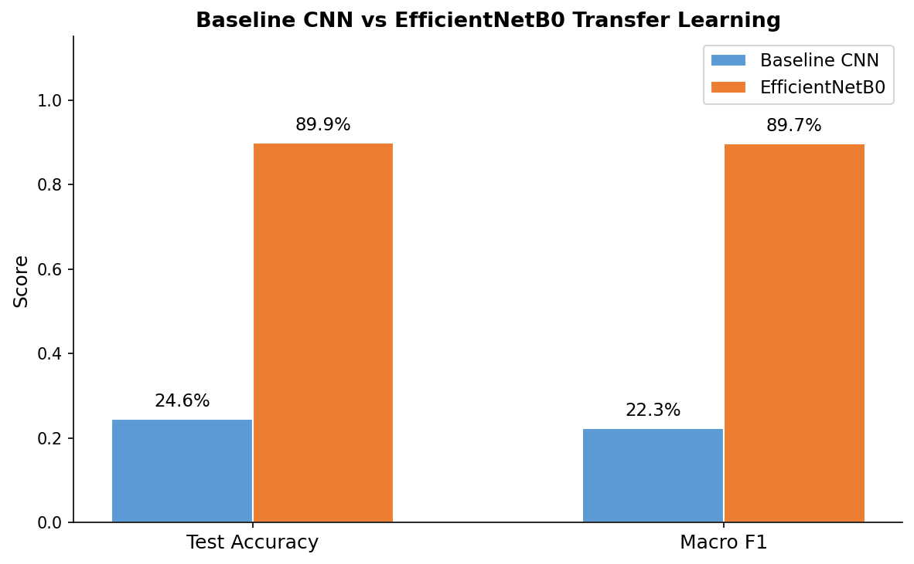
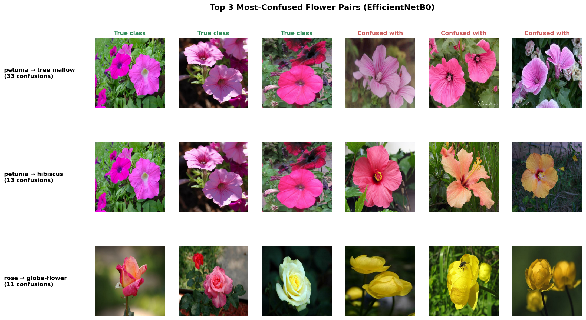

# Advanced DS and AI Portfolio Projects

Deep learning and AI portfolio projects, built with a structured methodology.

## Author

**Alberto Diaz Durana**
[GitHub](https://github.com/albertodiazdurana) | [LinkedIn](https://www.linkedin.com/in/albertodiazdurana/)

## Flower Classification (Oxford Flowers 102)

Transfer learning with EfficientNetB0 for 102-class flower species identification.

### Results

| Model | Test Accuracy | Macro F1 | Parameters | Training Time |
|-------|--------------|----------|------------|---------------|
| Baseline CNN | 24.56% | 0.1984 | 153K | 5.6 min |
| EfficientNetB0 (transfer) | **89.27%** | **0.8914** | 4.18M | 9.9 min |

- 3-phase progressive fine-tuning: head-only, top 30% unfreeze, full fine-tune
- Trained on 1,734 images (~10 per class), evaluated on 6,149 test images



### Error Analysis

Detailed analysis of the model's most-confused flower pairs reveals that errors concentrate on visually similar species (shared petal shape and color).



### Run the Notebook

**Option A — Google Colab (recommended):**
Upload `notebooks/flower-classification.ipynb` to Colab, select T4 GPU runtime, and run all cells.

**Option B — Local:**
```bash
python -m venv .venv
source .venv/bin/activate
pip install -r requirements_base.txt
pip install -r requirements_project.txt
jupyter lab notebooks/flower-classification.ipynb
```

Requires a CUDA-compatible GPU (tested on Quadro T1000, 4GB VRAM).

## Folder Structure

```
Advanced-DS-and-AI-Portfolio-Projects/
├── notebooks/                  # Jupyter notebooks (main deliverables)
│   └── outputs/figures/        # Saved plots from notebook cells
├── dsm-docs/                   # DSM methodology artifacts
│   ├── plans/                  # Sprint plans
│   ├── research/               # Research notes
│   ├── checkpoints/            # Session checkpoints
│   ├── decisions/              # Architecture decisions
│   └── feedback-to-dsm/        # Methodology feedback
├── requirements_base.txt       # Core Python dependencies
└── requirements_project.txt    # Project-specific dependencies
```
